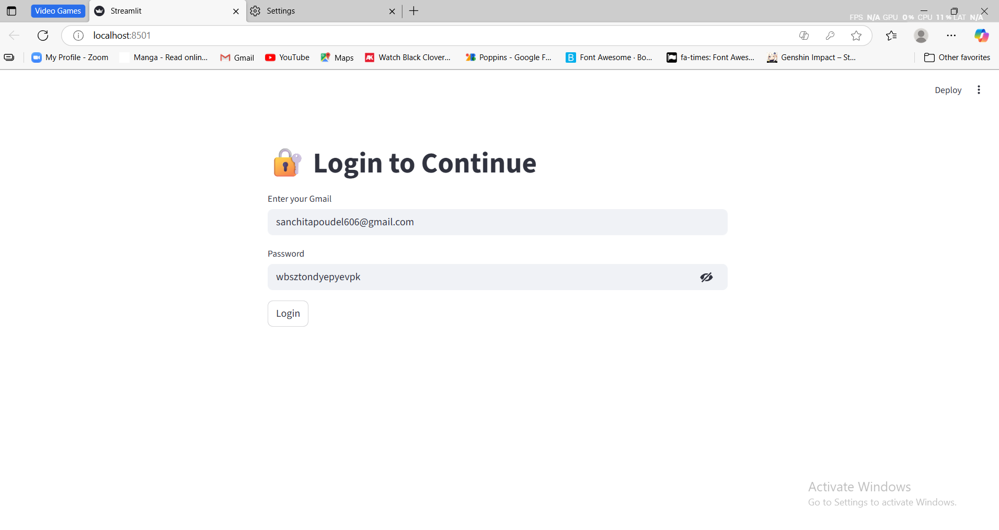
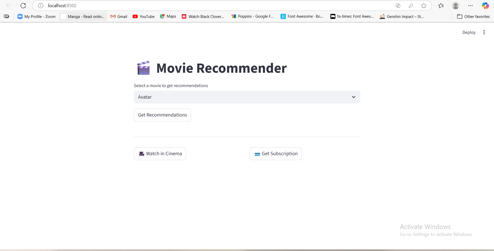

# Bipula-Rai
Portfolio
# 👋 Hi, I'm Bipula Rai

🎓 Final Year BSc CSIT Student | 💻 AI/ML Enthusiast | 🚀 Aspiring Machine Learning Engineer  

---

## 🧠 About Me
I'm a final-year Computer Science student at Tribhuvan University with a deep interest in Artificial Intelligence and Machine Learning.  
I enjoy building intelligent, user-focused applications that bridge data and creativity.

- 🔭 Currently working on: **Streamlit-based Movie Recommender & Cinema Booking App**
- 🌱 Learning: **Machine Learning, Deep Learning, and Python for AI**
- 💬 Ask me about: **Python, Streamlit, APIs, Recommender Systems**
- 📫 Reach me at: [bipularai11@gmail.com](mailto:bipularai11@gmail.com)
- 💼 LinkedIn: [linkedin.com/in/bipula-rai-7445b62b4](https://www.linkedin.com/in/bipula-rai-7445b62b4/)

---

## 🚀 Featured Projects

### 🎬 Movie Recommender & Cinema Booking App
> Streamlit app recommending movies, showing TMDB posters, and allowing seat booking with Gmail confirmations.

- 🧰 Tech Stack: Python, Streamlit, Pandas, TMDB API, SMTP  
- 🔗 [View Project](https://github.com/bipularai/-Movie-Recommender-and-Cinema-Booking-System-with-email-conformation-message/blob/main/main.py)  
- 🚀 Features: Login, Home, Movie Recommendations, Watch in Cinema, Booking, Subscriptions  

---

## 🖼️ Project Preview (click below to see the outputs)

  
🔐 Login Page

  

  
🏠 Home Page

  

  
🎬 Movie Recommendations

  
  

  
🎥 Watch in Cinema

  

  
🎟️ Ticket Booking

  
  

  
💳 Subscription Page

  

---

## 🧠 Tech Stack

  
  
  
  
  
  

---

## 🛠️ Skills

---

## 📈 GitHub Stats

---

⭐ **“Keep learning. Keep building. Keep growing.”**

